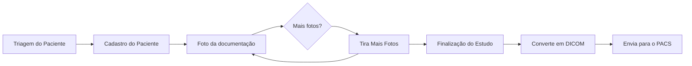

# DICOM COVID APP!

O **DICOM COVID APP** é um aplicativo multiplataforma baseado no framework apache Cordova, este aplicativo tem o intuito de DICOMIZAR imagens de documentos de um paciente e envia-los para o **PACS** utilizando um aplicativo móvel

# Estrutura de Telas V.1

A estrutura de telas é exibida na figura a seguir

## DICOM 
A conversão JPG para DICOM é feita pela bibliotera [http://dcmjs.org/](http://dcmjs.org/) que é uma compilação a partir da biblioteca em C++ DCMTK.

## Modalidade DICOM

A modalidade DICOM utilizada é XC 

|         MODALIDADE       |NOME                          |SOPCLASUID                         |
|----------------|-------------------------------|-----------------------------|
|XC|`External-camera Photography`            |1.2.840.10008.5.1.4.1.1.77.1.4           |
|

## Bibliotecas CORVODA

- [Share](https://docs.monaca.io/en/reference/third_party_phonegap/share/)
- [Câmera](https://docs.monaca.io/en/reference/cordova_9.0/camera/)
- [Device/](https://docs.monaca.io/en/reference/cordova_9.0/device/)
- [Dialogs/](https://docs.monaca.io/en/reference/cordova_9.0/dialogs/)
- [File/](https://docs.monaca.io/en/reference/cordova_9.0/file/)
- [File-transfer/](https://docs.monaca.io/en/reference/cordova_9.0/file-transfer/)
- [Media/](https://docs.monaca.io/en/reference/cordova_9.0/media/)
- [Network-information/](https://docs.monaca.io/en/reference/cordova_9.0/network-information/)
- [Vibration/](https://docs.monaca.io/en/reference/cordova_9.0/vibration/)
- [Statusbar/](https://docs.monaca.io/en/reference/cordova_9.0/statusbar/)

## APIS

- [https://viacep.com.br/](https://viacep.com.br/)
- SOASUS

## FLUXO 

Fluxograma da utilização:

